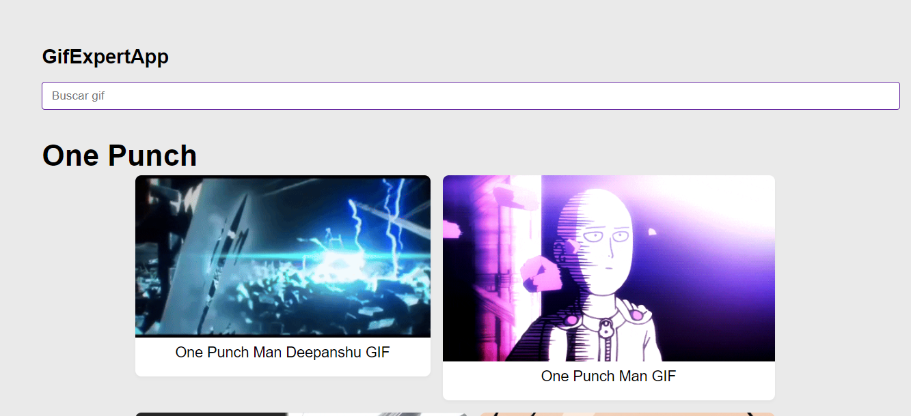
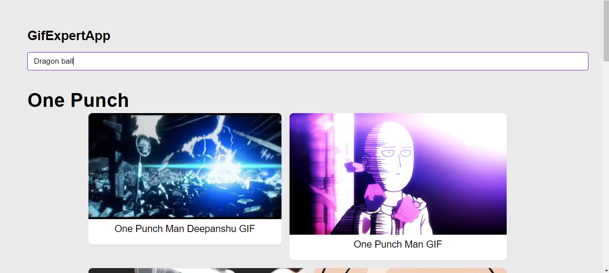
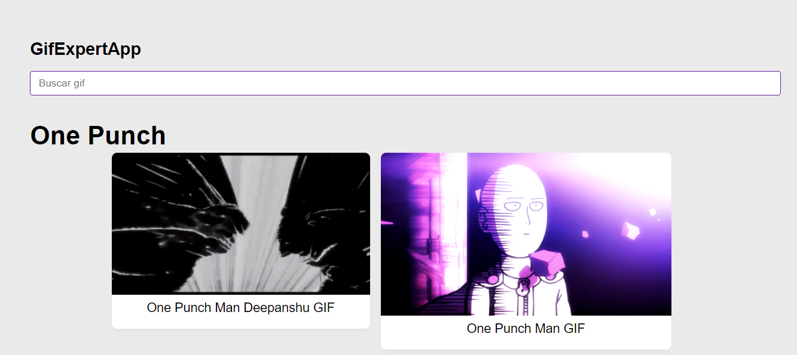

# GifExpertApp

Este es mi repositorio del proyecto GifExpertApp de React.
Esta aplicacion consiste en buscar algun gif que por medio 
de una API realiza una busqueda brindando diferentes gifs
en base a el texto que se esta buscando.

Una vez que se busca algo, la app busca los respectivos gifs
de lo que se pretendio buscar, ademas podemos ver que
la busqueda mas reciente se coloca como principal.

Una vez se recarga la pagina es cuando vuelve al gif por
default el cual en este caso es de "One Punch Man".
